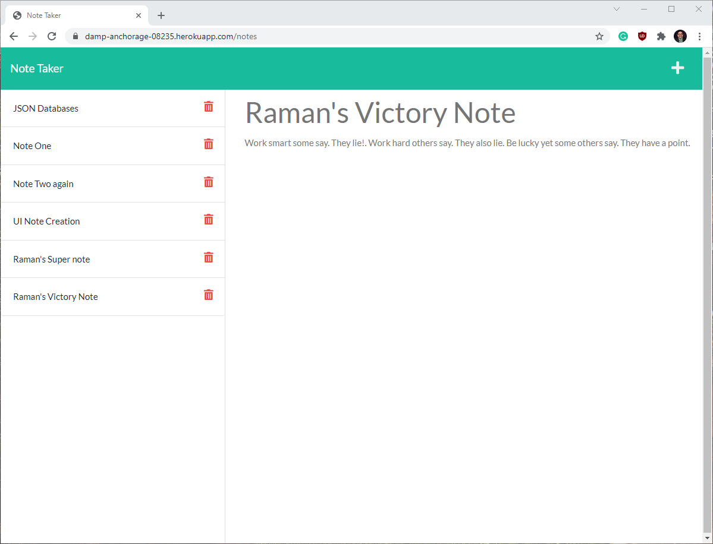

# rvt_note_taker
> An application that stores and retrieves notes and reminders.

## Table of contents
  - [General info](#general-info)
  - [Screenshots](#screenshots)
  - [Deployed URL](#deployed-url)
  - [Setup](#setup)
  - [Code](#code)
  - [Licenses](#licenses)
  - [Developer(s)](#developers)

## General info
This is a simple application that allows the user to create, save, edit, and delete text-based notes.  The application was written using JavaScript, HTML and CSS frontend. The backend uses the Node.js JavaScript runtime environment and Express.js back end web application framework for Node.js. 

## Screenshots

## Deployed URL
[Heroku Deployment](https://damp-anchorage-08235.herokuapp.com/)

## Setup
* Clone the repo (https://github.com/ramantv/rvt_note_taker)
* run these commands in order:
   1. npm install
   2. npm start

## Code
* HTML/CSS
* JavaScript
* Bootstrap
* Node.js
* Express.js
* Uniqid - To create identifiers for notes.
* fs - For file write/read operations.
* path - allows files to be directed to specific directories
* Heroku - application deployment 

## Licenses
 
 

## Developer(s)
* [Raman TV.](https://github.com/ramantv)
